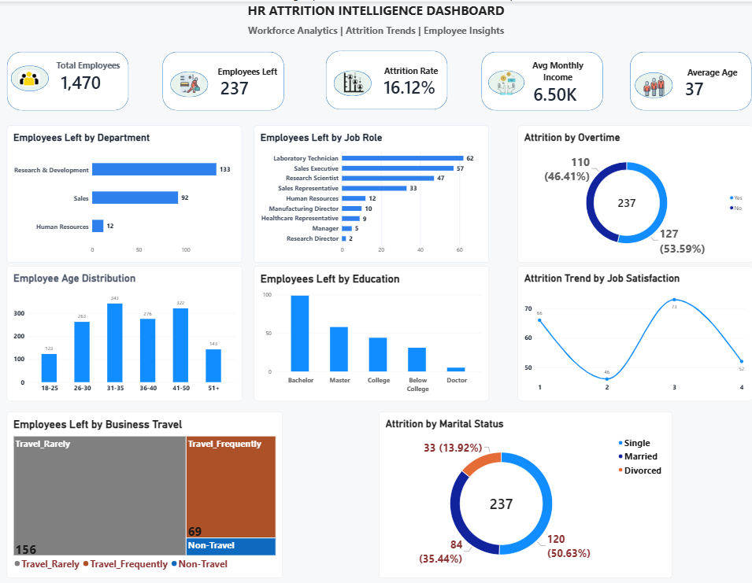
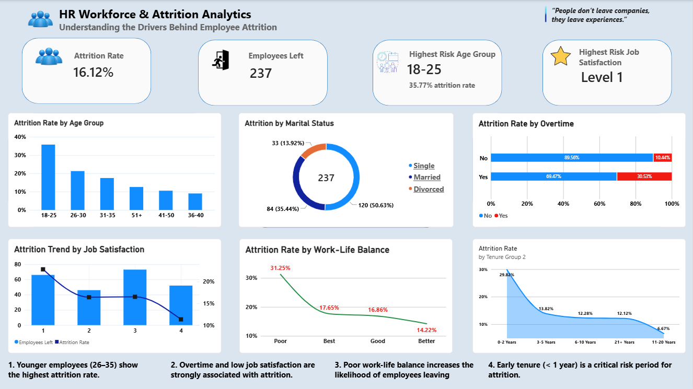
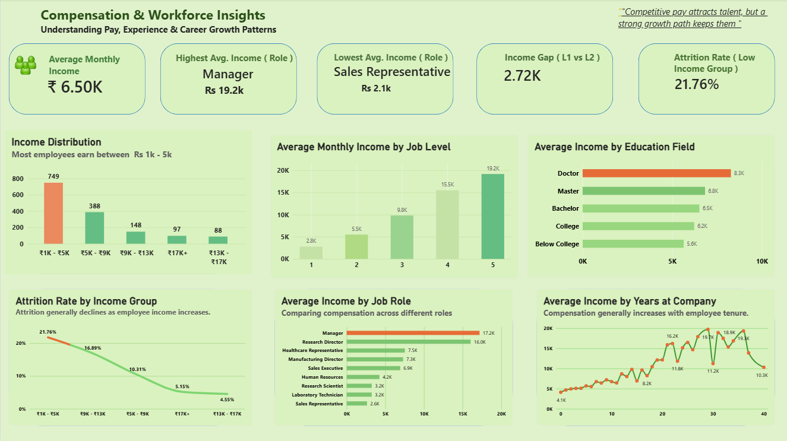

# HR Workforce & Attrition Analytics

An end-to-end Power BI analytics project exploring employee attrition, workforce demographics, job satisfaction, compensation, and employee tenure.

---

## Project Overview

Employee attrition can significantly impact organizational productivity, recruitment costs, and workforce stability.

This project analyzes HR employee data to identify key factors associated with employee attrition and understand compensation and workforce patterns.

The dashboard is divided into three analytical sections:

- Executive Overview
- Attrition Deep Dive
- Compensation & Workforce Insights

---

## Objectives

- Analyze overall employee attrition.
- Identify high-risk employee groups.
- Understand the impact of overtime on attrition.
- Analyze job satisfaction and work-life balance.
- Explore compensation patterns across job roles and levels.
- Examine the relationship between income, tenure, and attrition.

---

# Dashboard 1: Executive Overview

Provides a high-level view of the workforce and key employee metrics.

Key areas analyzed:

- Total employees
- Attrition rate
- Employees who left
- Active employees
- Department distribution
- Workforce demographics
- Job role distribution



---

# Dashboard 2: Attrition Deep Dive

Focuses on identifying the major drivers behind employee attrition.

### Key Insights

- Employees aged 18–25 show the highest attrition rate.
- Overtime is strongly associated with employee attrition.
- Lower job satisfaction levels are associated with higher attrition.
- Poor work-life balance increases the likelihood of employees leaving.
- Early tenure is a critical risk period for employee attrition.



---

# Dashboard 3: Compensation & Workforce Insights

Analyzes salary distribution and compensation patterns across the workforce.

### Key Insights

- Average monthly income: ₹6.50K
- Highest average income role: Manager
- Lowest average income role: Sales Representative
- Income gap between Job Level 1 and Job Level 2: ₹2.72K
- Low-income employee attrition rate: 21.76%
- Attrition generally decreases as employee income increases.
- Compensation increases significantly with job level.
- Income varies across job roles and education levels.
- Employee tenure generally shows increasing compensation trends.



---

## Tools & Technologies

- Microsoft Power BI
- Microsoft Excel
- Power Query
- DAX
- Data Cleaning
- Data Visualization
- Exploratory Data Analysis

---

## Key DAX Measures Created

Some of the key calculations used in the dashboard include:

- Attrition Rate
- Total Employees
- Employees Left
- Average Monthly Income
- Highest Average Income Role
- Lowest Average Income Role
- Income Gap (Level 1 vs Level 2)
- Low Income Attrition Rate

---

## Dataset

The dataset contains employee-level HR information including:

- Age
- Attrition
- Department
- Job Role
- Job Level
- Monthly Income
- Education
- Marital Status
- Overtime
- Job Satisfaction
- Work-Life Balance
- Years at Company

---

## Repository Structure

```text
hr-workforce-attrition-analytics/
│
├── HR_Workforce_Attrition_Analytics.pbix
├── WA_Fn-UseC_-HR-Employee-Attrition.xlsx
├── README.md
│
├── dashboard_1_executive_overview.png.png
├── dashboard_2_attrition_deep_dive.png.png
└── dashboard_3_compensation_workforce_insights.png.png

Business Recommendations

Based on the analysis, organizations should consider:

Monitoring younger employees and early-tenure employees more closely.
Improving work-life balance initiatives.
Reviewing overtime policies to reduce employee burnout.
Improving job satisfaction through career development and employee engagement.
Ensuring competitive compensation for lower-income employee groups.
Creating stronger retention strategies for high-risk employee segments.
Author

Vardhan Shewale

Economics Graduate | Aspiring Data Analyst

Skills: Excel | SQL | Power BI | DAX | Data Analysis | Data Visualization
